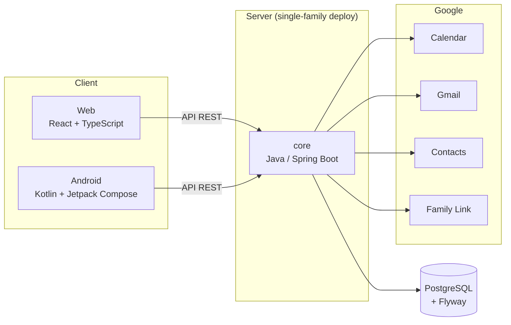

# FamilyManager

> Questo documento descrive la visione e le funzionalità previste per il prodotto; non è un inventario di ciò che è già
> implementato. Per lo stato corrente, l'architettura e l'avvio del codice, fare riferimento a [`docs/`](docs/README.md).

> *Tutto quello che conta, insieme.*

**FamilyManager** è una piattaforma all-in-one per la gestione della vita familiare: calendario condiviso, lista della
spesa, pianificazione dei pasti, salute, attività, compleanni, vacanze, lavoro, note e un **albero genealogico**
navigabile. Il tutto con una forte integrazione con i servizi Google (Calendar, Gmail, Contacts, Family Link) e un'app
Android nativa.

Il progetto è pensato per il modello **una famiglia per installazione**: ogni deploy serve una sola famiglia, senza
multi-tenancy.

---

## Indice

1. [Obiettivi](#obiettivi)
2. [Funzionalità](#funzionalità)
3. [Architettura](#architettura)
4. [Stack tecnologico](#stack-tecnologico)
5. [Struttura del repository](#struttura-del-repository)
6. [Modello dati](#modello-dati)
7. [Modellazione delle relazioni familiari](#modellazione-delle-relazioni-familiari)
8. [Autorizzazioni (ReBAC)](#autorizzazioni-rebac)
9. [Integrazioni Google](#integrazioni-google)
10. [Interfaccia utente](#interfaccia-utente)
11. [Per iniziare](#per-iniziare)
12. [Decisioni architetturali](#decisioni-architetturali)

---

## Obiettivi

- Riunire in **un solo posto** gli strumenti che una famiglia usa ogni giorno, oggi sparsi tra app diverse.
- Integrarsi con l'ecosistema **Google** invece di sostituirlo: i dati restano coerenti con gli strumenti che la
  famiglia già usa.
- Offrire un'esperienza **nativa su Android** (notifiche push, widget, integrazione profonda con il sistema) e
  un'interfaccia **web** moderna.
- Restare **semplice da installare e mantenere**: un deploy, una famiglia, un database.
- Partire sempre dalle **ultime versioni stabili** delle tecnologie, per evitare migrazioni future dolorose.

## Funzionalità

Le sezioni dell'applicazione, come da mockup:

| Sezione                | Descrizione                                                                                                                 |
|------------------------|-----------------------------------------------------------------------------------------------------------------------------|
| **Home**               | Dashboard con riepilogo del giorno: appuntamenti, pasti, spesa, salute, attività, compleanni, prossima vacanza e promemoria |
| **Calendario**         | Vista mensile e giornaliera degli impegni di tutta la famiglia, con creazione rapida di eventi                              |
| **Pasti**              | Piano pasti settimanale (pranzo e cena) con vista a lista                                                                   |
| **Spesa**              | Lista della spesa condivisa, filtrabile per categoria (frutta e verdura, dispensa, altro)                                   |
| **Salute**             | Visite, vaccinazioni, controlli ed esami per ogni membro, con stato (completato, in programma, da fare)                     |
| **Attività**           | Sport, tempo libero e studio (allenamenti, corsi, escursioni)                                                               |
| **Compleanni**         | Elenco con conto alla rovescia e promemoria per i regali                                                                    |
| **Eventi**             | Eventi familiari e ricorrenze                                                                                               |
| **Vacanze**            | Vacanze in programma e passate, con checklist di cose da fare                                                               |
| **Lavoro**             | Impegni e informazioni legate al lavoro                                                                                     |
| **Albero genealogico** | Vista grafica e a elenco dei rapporti di parentela, con scheda dettaglio per ciascun membro                                 |
| **Note**               | Note condivise                                                                                                              |

Funzionalità trasversali: ricerca di familiari, notifiche, profili dei membri (relazioni, data e luogo di nascita, note)
e controllo degli accessi in base alle relazioni.

## Architettura



Il backend (`core`) espone le API a entrambi i client e centralizza logica di dominio, permessi e integrazioni. Web e
Android sono client indipendenti dello stesso backend.

## Stack tecnologico

| Ambito              | Tecnologia                                    |
|---------------------|-----------------------------------------------|
| Backend             | Java 25, Spring Boot 4.0.7                    |
| Database            | PostgreSQL, migrazioni con Flyway             |
| Frontend web        | React + TypeScript                            |
| Android             | Kotlin 2.2.21, Jetpack Compose, Gradle        |
| Build backend / web | Maven (multi-module mono-repo)                |
| Container           | Docker                                        |
| Integrazioni        | Google Calendar, Gmail, Contacts, Family Link |

Con Spring Boot 4 e la relativa base tecnologica valgono alcuni cambiamenti importanti rispetto alle versioni
precedenti:

- `spring-boot-starter-web` è sostituito da `spring-boot-starter-webmvc`
- Jackson 3, con nuovo groupId `tools.jackson.*`
- Jakarta EE 11

Il `groupId` Maven del progetto è `com.tatonimatteo`.

## Struttura del repository

```
FamilyManager/
├── pom.xml          # POM radice (reactor Maven)
├── core/            # Backend Java / Spring Boot
├── web/             # Frontend React + TypeScript
├── docker/          # Build e push delle immagini
└── fit/             # Test di integrazione (tooling ancora da decidere)

FamilyManager-Android/   # Progetto Gradle separato, fratello del mono-repo
```

**Perché Android è fuori dal reactor Maven?** Il progetto Android usa Gradle e non può partecipare al reactor Maven.
Vive quindi come progetto *sibling*, con ciclo di build proprio, ma consuma le stesse API del backend.

## Modello dati

Lo schema PostgreSQL, gestito da Flyway (migrazione `V1`), comprende:

| Tabella               | Ruolo                                                                              |
|-----------------------|------------------------------------------------------------------------------------|
| `ACCOUNTS`            | Credenziali e identità di accesso                                                  |
| `PERSONS`             | Le persone della famiglia (anche chi non ha un account, ad esempio i nonni)        |
| `HOUSEHOLDS`          | I nuclei familiari / abitativi                                                     |
| `RELATIONSHIPS`       | Relazioni **atomiche** tra persone                                                 |
| `NICKNAMES`           | Appellativi ("Mamma", "Nonno", "Zio Andrea") legati al punto di vista di chi parla |
| `PERMISSION_GRANTS`   | Permessi concessi in base alle relazioni                                           |
| `GOOGLE_INTEGRATIONS` | Stato e credenziali delle integrazioni Google                                      |

La distinzione tra `ACCOUNTS` e `PERSONS` permette di rappresentare nell'albero anche persone senza accesso al sistema
(o non più in vita).

## Modellazione delle relazioni familiari

Il sistema memorizza **solo le relazioni atomiche**:

- `PARENT_OF`
- `SPOUSE_OF`
- `PARTNER_OF`

Tutte le relazioni **derivate** (nonni, fratelli, zii, cugini, cognati…) sono **calcolate al volo** con query SQL
ricorsive (`WITH RECURSIVE`), implementate come query native in `RelationshipRepository`.

Vantaggi di questo approccio:

- **Nessuna ridondanza**: un'informazione ha una sola fonte di verità.
- **Nessuna incoerenza** da propagare quando una relazione cambia.
- **Schema pulito** e facile da estendere con nuovi tipi di parentela derivata, senza migrazioni di dati.

## Autorizzazioni (ReBAC)

L'accesso ai dati segue il modello **ReBAC** (*Relationship-Based Access Control*): chi può vedere o modificare una
risorsa dipende dalla **relazione** tra le persone coinvolte, non solo da un ruolo statico.

Questo si integra in modo naturale con il modello a grafo delle relazioni familiari: ad esempio, un genitore può gestire
le informazioni sanitarie dei propri figli, mentre altri parenti possono avere solo accesso in lettura al calendario. Le
regole esplicite sono registrate in `PERMISSION_GRANTS`.

## Integrazioni Google

L'integrazione con Google è un pilastro del progetto:

- **Calendar**: sincronizzazione degli eventi familiari
- **Gmail**: collegamento con la posta
- **Contacts**: importazione e allineamento dei contatti
- **Family Link**: parental controls

Lo stato di ogni integrazione è tracciato nella tabella `GOOGLE_INTEGRATIONS`.

## Interfaccia utente

I mockup definiscono uno stile chiaro e moderno:

- **Desktop**: sidebar di navigazione a sinistra, dashboard a schede colorate per area (appuntamenti, pasti, spesa,
  salute, attività, compleanni), barra di ricerca e profilo in alto.
- **Mobile**: navigazione a tab in basso (Home, Calendario, Pasti, Altro), pulsante di azione rapida e liste con filtri
  a chip.
- **Albero genealogico**: vista grafica con nodi colorati per genere, legenda (coppia, genitore → figlio, selezionato),
  pannello laterale con relazioni e informazioni del membro selezionato, e alternativa a elenco.

Il logo e il nome mostrati nell'interfaccia sono provvisori: *"La nostra famiglia"*.

## Per iniziare

### Prerequisiti

- JDK 25
- Maven
- PostgreSQL
- Node.js (per il modulo `web`)
- Android Studio (per l'app Android)
- Docker (per le immagini)

### Database

Crea un database PostgreSQL per l'applicazione e imposta i parametri di connessione in
`core/src/main/resources/application.yml`. Le migrazioni Flyway vengono eseguite all'avvio del backend.

### Build del backend

```bash
mvn clean install
```

### Avvio del backend

```bash
mvn -pl core spring-boot:run
```

### App Android

Il progetto Android è separato: aprilo con Android Studio ed eseguilo con Gradle.

## Decisioni architetturali

| Decisione                                                    | Motivazione                                       |
|--------------------------------------------------------------|---------------------------------------------------|
| Relazioni atomiche + query ricorsive                         | Nessuna ridondanza, schema semplice               |
| ReBAC per i permessi                                         | Coerente con la natura a grafo dei dati familiari |
| **No** multi-tenancy (rimossi `FAMILY_GROUPS` e `tenant_id`) | Una famiglia per deploy: meno complessità         |
| Android fuori dal reactor Maven                              | Gradle non è integrabile nel reactor Maven        |
| Ultime versioni stabili fin da subito                        | Evitare migrazioni future                         |
| Mono-repo Maven per backend e web                            | Un solo punto di build e versionamento            |
